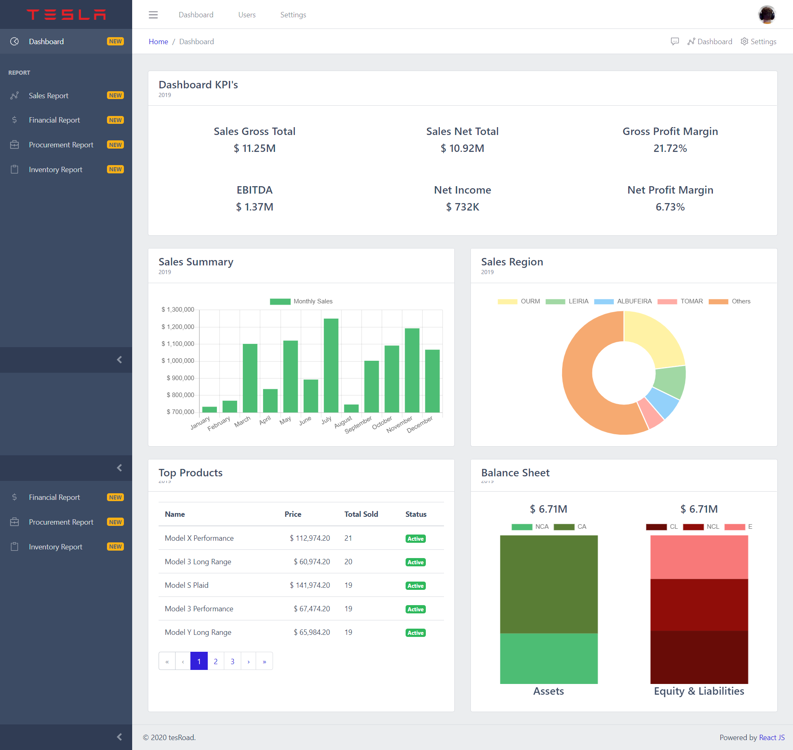
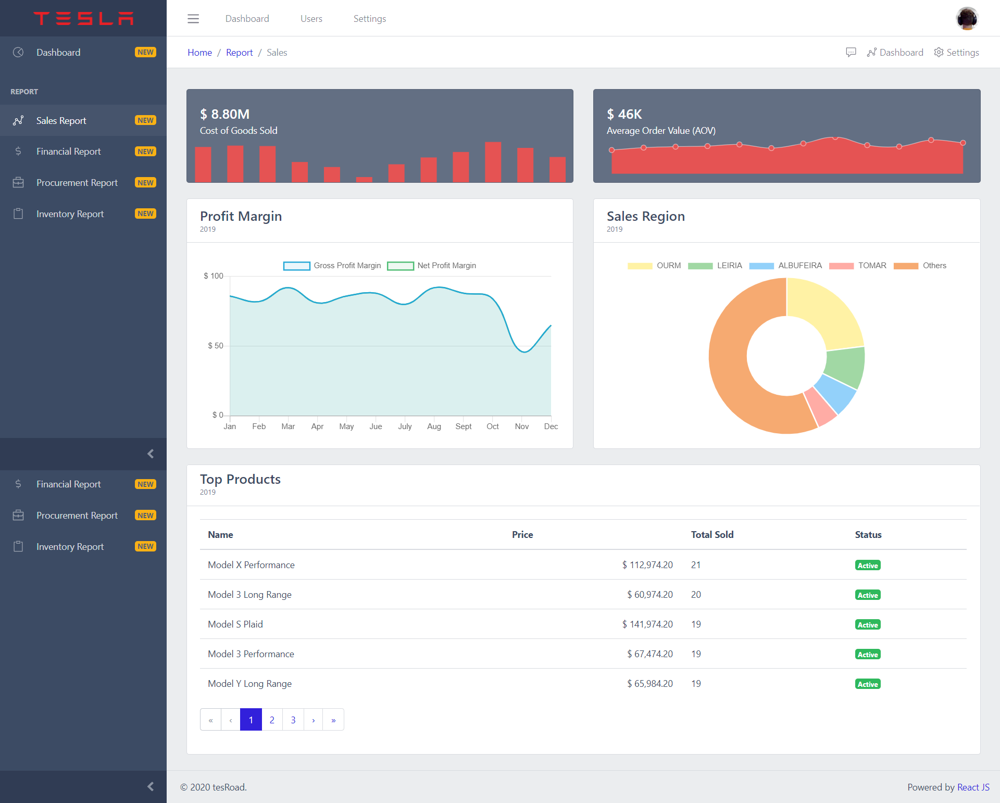
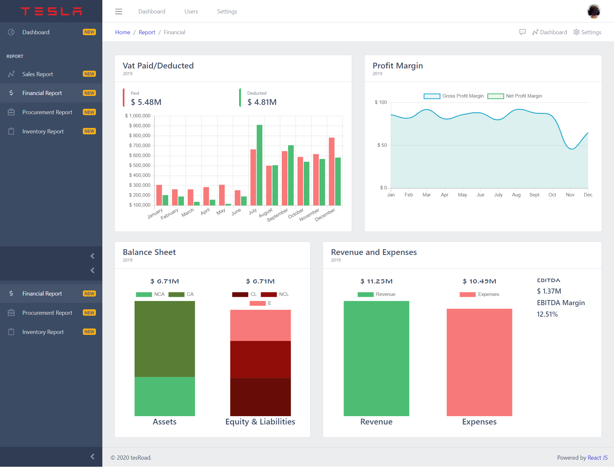
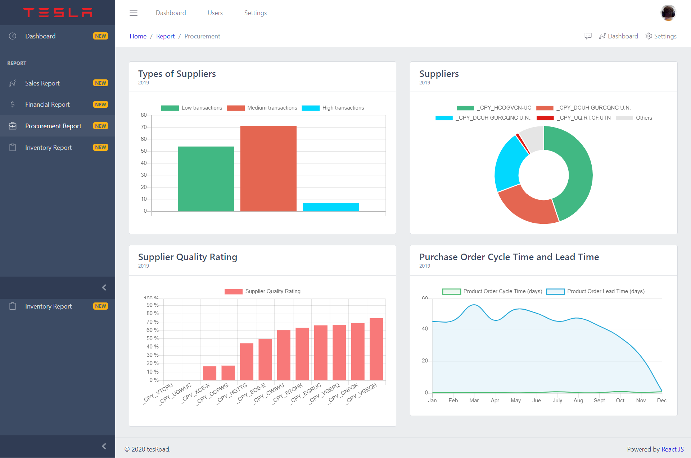
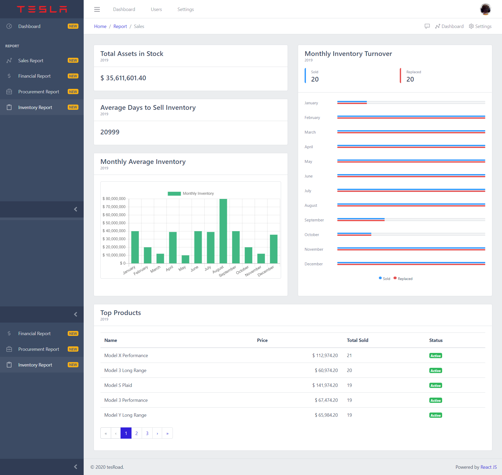

# Company Dashboard

## Description
Develop a Web app to provide to a complete information of the company status, regarding the
information that is contained on the SAF-T (standard audit file for tax purposes) and information
regarding sales orders, purchases, inventory, and accounts payable, using a dashboard to
provide high level/graphical information with drill down functionalities

## Docs
You can read our presentation [here](https://github.com/motapinto/company-dashboard/blob/main/docs/final-report.pdf)!

## Gallery
<p>





</p>

## Usage
```
npm install
cd api/
npm run parse -- saft_accounting_2019.xml
cd ..
npm start
```
